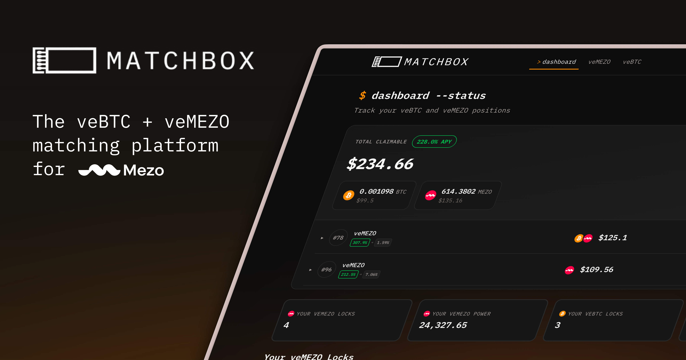

import { Card, CardGrid, LinkCard } from '@astrojs/starlight/components';

## Get Started

Matchbox is a matching protocol that connects veBTC holders with veMEZO holders on the Mezo Network. It creates a marketplace where both sides can maximize their earning potential through strategic voting and incentives.

<CardGrid>
  <LinkCard
    title="Getting Started"
    description="Connect your wallet and explore the Matchbox platform."
    href="/docs/getting-started"
  />
  <LinkCard
    title="Core Concepts"
    description="Understand veBTC, veMEZO, gauges, and epochs."
    href="/docs/concepts"
  />
</CardGrid>

## For veMEZO Holders

Use your voting power to earn rewards by voting on gauges with attractive incentives.

<CardGrid>
  <LinkCard
    title="Voting Guide"
    description="Learn how to browse gauges, evaluate incentives, and vote strategically."
    href="/docs/guides/voting"
  />
  <LinkCard
    title="Understanding veMEZO"
    description="Deep dive into how veMEZO voting power works."
    href="/docs/concepts/vemezo"
  />
</CardGrid>

## For veBTC Holders

Attract votes to boost your veBTC position up to 5x by offering incentives.

<CardGrid>
  <LinkCard
    title="Managing Gauges"
    description="Create gauge profiles and add incentives to attract voters."
    href="/docs/guides/managing-gauges"
  />
  <LinkCard
    title="Understanding veBTC"
    description="Learn how veBTC positions and boost multipliers work."
    href="/docs/concepts/vebtc"
  />
</CardGrid>

## Learn

Understand the core mechanics that power Matchbox.

<CardGrid>
  <LinkCard
    title="Gauges"
    description="How gauges receive votes and distribute rewards."
    href="/docs/concepts/gauges"
  />
  <LinkCard
    title="Epochs"
    description="Weekly voting periods and timing mechanics."
    href="/docs/concepts/epochs"
  />
  <LinkCard
    title="Dashboard Guide"
    description="Navigate the Matchbox dashboard and track your positions."
    href="/docs/guides/dashboard"
  />
  <LinkCard
    title="FAQ"
    description="Common questions and answers about Matchbox."
    href="/docs/reference/faq"
  />
</CardGrid>

## Resources

<CardGrid>
  <LinkCard
    title="Glossary"
    description="Key terms and definitions explained."
    href="/docs/reference/glossary"
  />
  <LinkCard
    title="Mezo Earn"
    description="Lock BTC or MEZO to obtain veBTC/veMEZO."
    href="https://mezo.org/docs/users/mezo-earn"
  />
</CardGrid>
